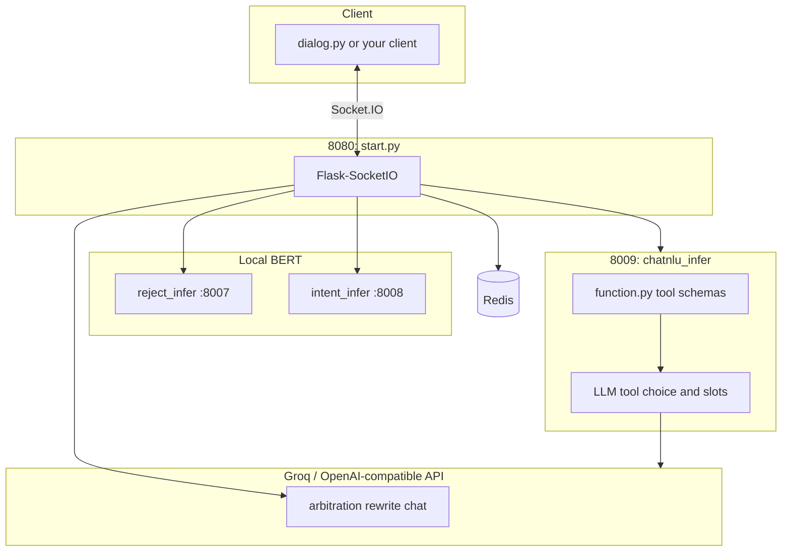
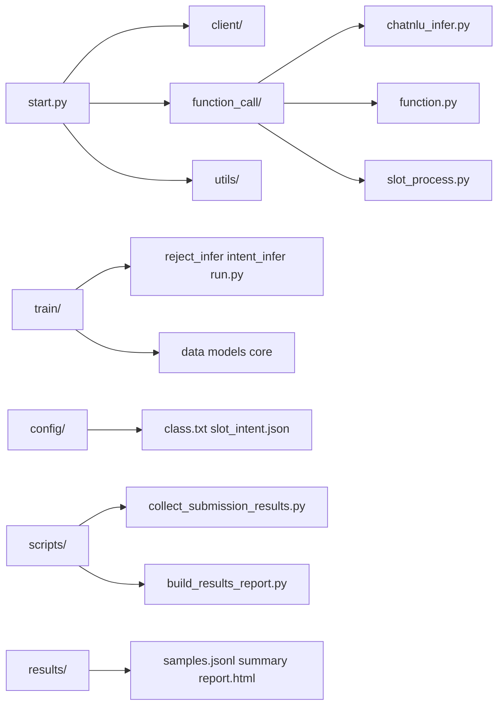

# Robot NLU agent

BERT reject/intent classifiers, a remote LLM for arbitration and tool calling, and a Flask-SocketIO entrypoint. Tool schemas live in `function_call/function.py`; prompts in `prompts.py`.

---

## Architecture



## Code map



---

## Run locally (Windows PowerShell)

Use **Python 3.10+** (3.12 is fine). Do not use Python 3.7 for this repo.

**If `Activate.ps1` is blocked** (`execution of scripts is disabled`), either allow scripts for your user once:

```powershell
Set-ExecutionPolicy -Scope CurrentUser -ExecutionPolicy RemoteSigned
```

or **skip activation** and call the venv interpreter by path (see below).

**Venv without activating (recommended on locked-down PowerShell)**

```powershell
cd c:\Users\gloria\Desktop\Tutorial7_exercise\robot_agent_project
py -3.12 -m venv .venv
.\.venv\Scripts\python.exe -m pip install -U pip
.\.venv\Scripts\python.exe -m pip install -r requirements-minimal.txt
```

Use the same `.\.venv\Scripts\python.exe` for every service (`start.py`, `train\reject_infer.py`, etc.). Set `PYTHONPATH` to the repo root before each command.

Full `requirements.txt` is huge (CUDA, notebooks, etc.); use it only if you need everything. For normal gateway + BERT + NLU, `requirements-minimal.txt` is enough.

**2. Redis** must be running on `127.0.0.1:6379`. Check:

```powershell
redis-cli ping
```

**3. Environment**

Create a file named `.env` in the repo root with at least `API_KEY` (e.g. `Bearer gsk_...`) and `BASE_URL` (Groq or OpenAI-compatible chat URL). Optional: `REJECT_URL`, `INTENT_URL`, `NLU_URL`, `ENTRY_URL`, `FLASK_SERVER_PORT` default to localhost ports 8007–8009 and 8080.

**4. Four terminals** — use the **same** interpreter as in step 1 (example: `.\.venv\Scripts\python.exe`). Set `PYTHONPATH` to the repo root in each.

Terminal A:

```powershell
cd c:\Users\gloria\Desktop\Tutorial7_exercise\robot_agent_project
$env:PYTHONPATH = (Get-Location).Path
cd train
..\.venv\Scripts\python.exe reject_infer.py
```

Terminal B:

```powershell
cd c:\Users\gloria\Desktop\Tutorial7_exercise\robot_agent_project
$env:PYTHONPATH = (Get-Location).Path
cd train
..\.venv\Scripts\python.exe intent_infer.py
```

Terminal C:

```powershell
cd c:\Users\gloria\Desktop\Tutorial7_exercise\robot_agent_project
$env:PYTHONPATH = (Get-Location).Path
cd function_call
..\.venv\Scripts\python.exe chatnlu_infer.py
```

Terminal D:

```powershell
cd c:\Users\gloria\Desktop\Tutorial7_exercise\robot_agent_project
$env:PYTHONPATH = (Get-Location).Path
.\.venv\Scripts\python.exe start.py
```

If you did not create `.venv`, replace `..\.venv\Scripts\python.exe` / `.\.venv\Scripts\python.exe` with `py -3.12` or `python` (must be 3.10+). Optional full install: `pip install -r requirements.txt` in that environment.

**5. Health check**

```powershell
Invoke-WebRequest -Uri http://127.0.0.1:8080/health -UseBasicParsing | Select-Object -ExpandProperty Content
```

**6. Interactive client**

```powershell
cd c:\Users\gloria\Desktop\Tutorial7_exercise\robot_agent_project
.\.venv\Scripts\python.exe dialog.py
```

**7. Collect submission artifacts** (services must stay up)

```powershell
cd c:\Users\gloria\Desktop\Tutorial7_exercise\robot_agent_project
$env:PYTHONPATH = (Get-Location).Path
.\.venv\Scripts\python.exe scripts/collect_submission_results.py
```

Then open `results/report.html` in a browser. Optional: `.\.venv\Scripts\python.exe scripts/build_results_report.py` to refresh only the HTML.

**Shortcut:** from repo root, `.\start_windows.bat` starts the four processes in separate windows (still need Redis and `.env` first).
