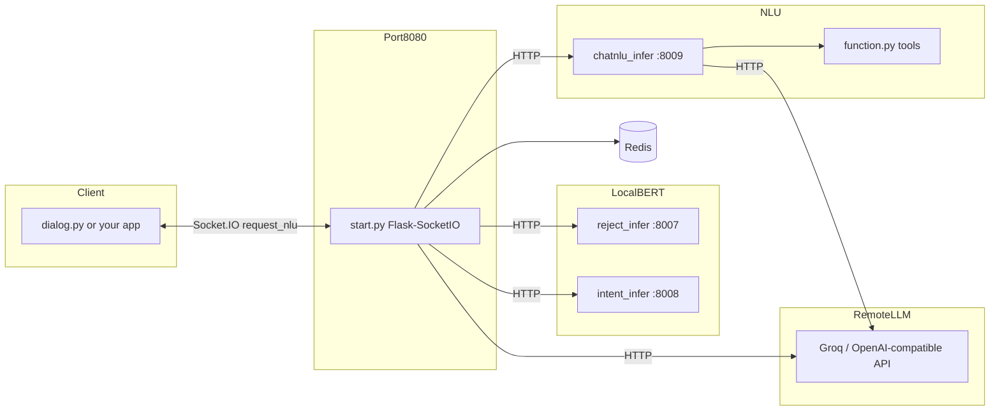
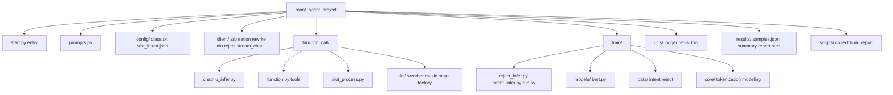
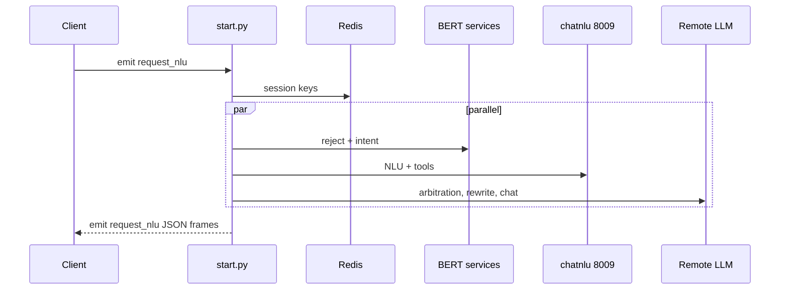

# Project layout and runtime

GitHub renders the diagrams below if you view this file on the site.

### Runtime (who talks to whom)

### Repository tree (main pieces)

### Typical request path (simplified)

There is no automatic PNG screenshot in the repo. After `python scripts/collect_submission_results.py`, run `python scripts/build_results_report.py` and open `results/report.html` in a browser to screenshot the formatted table.
